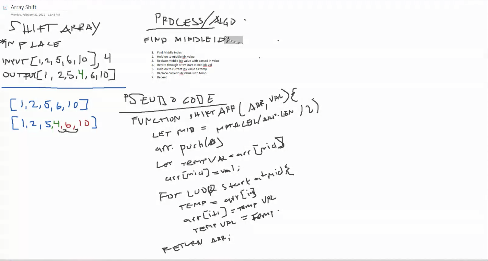

# Reverse an Array

Write a function that reverses an array, in place

Be careful of: empty arrays, arrays with only 1, odd numbered count, even numbered count
<!-- Short summary or background information -->

## Challenge
<!-- Description of the challenge -->

## Approach & Efficiency
<!-- What approach did you take? Why? What is the Big O space/time for this approach? -->

- Identify the start and end of the array (0 and length -1)
- Swap the arr[start] with arr[end]
- Move Start forward by 1
- Move End backwards by 1
- Repeat while start <= end

## Solution
<!-- Embedded whiteboard image -->

# Shift Array

### 

- Insert a new value into the middle of an array without using any built in methods

## Challenge
Write a function called insertShiftArray which takes in an array and the value to be added. Without utilizing any of the built-in methods available to your language, return an array with the new value added at the middle index.

## Approach & Efficiency
A math method with a loop and a push to an array that is returned 

## Solution
<!-- Embedded whiteboard image -->
;

