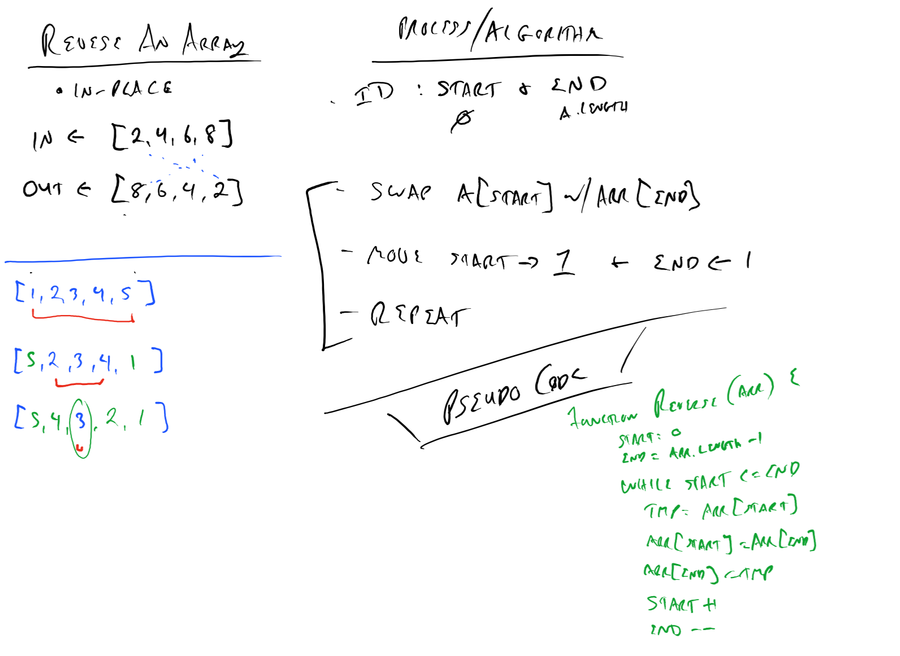

# Reverse an Array

Write a function that reverses an array, in place

Be careful of: empty arrays, arrays with only 1, odd numbered count, even numbered count
<!-- Short summary or background information -->

## Challenge
<!-- Description of the challenge -->

## Approach & Efficiency
<!-- What approach did you take? Why? What is the Big O space/time for this approach? -->

- Identify the start and end of the array (0 and length -1)
- Swap the arr[start] with arr[end]
- Move Start forward by 1
- Move End backwards by 1
- Repeat while start <= end

## Solution
<!-- Embedded whiteboard image -->

# Shift Array

### 

- Insert a new value into the middle of an array without using any built in methods

## Challenge
Write a function called insertShiftArray which takes in an array and the value to be added. Without utilizing any of the built-in methods available to your language, return an array with the new value added at the middle index.

## Approach & Efficiency
A math method with a loop and a push to an array that is returned 

## Solution
<!-- Embedded whiteboard image -->
;

# Array - Binary - Search

### 

- Utilize binary search 

## Challenge

- Write a function called BinarySearch which takes in 2 parameters: a sorted array and the search key. Without utilizing any of the built-in methods available to your language, return the index of the array’s element that is equal to the search key, or -1 if the element does not exist.

## Approach & Efficiency
- Go through the array comparing the key if the key is greater than certain number we get rid of those numbers and repeat from the opposite end until we find our number or if the number is not there we return -1.

## Solution
<!-- Embedded whiteboard image -->
;

# Stack and a Queue Implementation

## Challenge
### Create a Node class that has properties for the value stored in the Node, and a pointer to the next node. Create a Stack class that has a top property. It creates an empty Stack when instantiated. This object should be aware of a default empty value assigned to top when the stack is created. Define a method called push which takes any value as an argument and adds a new node with that value to the top of the stack with an O(1) Time performance. Define a method called pop that does not take any argument, removes the node from the top of the stack, and returns the node’s value. Should raise exception when called on empty stack Define a method called peek that does not take an argument and returns the value of the node located on top of the stack, without removing it from the stack. Should raise exception when called on empty stack Define a method called isEmpty that takes no argument, and returns a boolean indicating whether or not the stack is empty. Create a Queue class that has a front property. It creates an empty Queue when instantiated. This object should be aware of a default empty value assigned to front when the queue is created. Define a method called enqueue which takes any value as an argument and adds a new node with that value to the back of the queue with an O(1) Time performance. Define a method called dequeue that does not take any argument, removes the node from the front of the queue, and returns the node’s value. Should raise exception when called on empty queue Define a method called peek that does not take an argument and returns the value of the node located in the front of the queue, without removing it from the queue. Should raise exception when called on empty queue. Define a method called isEmpty that takes no argument, and returns a boolean indicating whether or not the queue is empty.
## Approach & Efficiency
<!-- What approach did you take? Why? What is the Big O space/time for this approach? -->

- Added new items to the queues and stacks and then removed an item and continued creating methods within each file that would complete the challenge.

## Solution
<!-- Embedded whiteboard image -->

