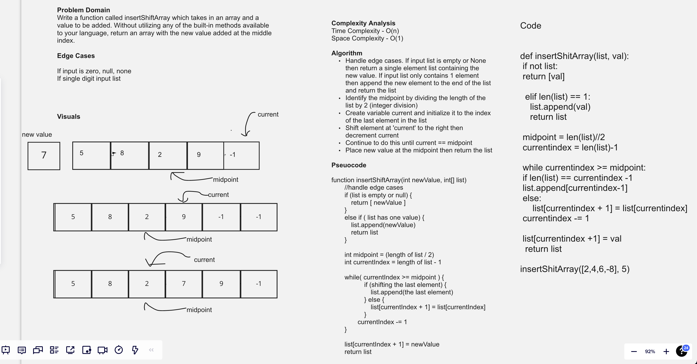
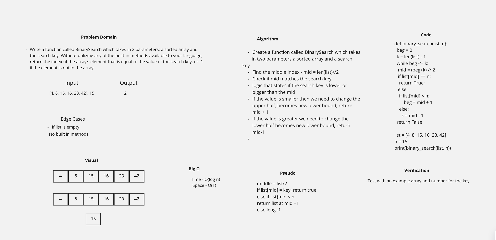

# Code Challenges

# Reverse an Array

## Challenge

<!-- Description of the challenge -->

Write a function that reverses an array, in place

Be careful of: empty arrays, arrays with only 1, odd numbered count, even numbered count

## Approach & Efficiency

<!-- What approach did you take? Why? What is the Big O space/time for this approach? -->

-   Create a function that takes in an array
-   Inserting at zero th position
-   Reversed array complete

## Solution

<!-- Embedded whiteboard image -->

# Insert value into middle of list

-   Write a function called insertShiftArray which takes in an array and a value to be added. Without utilizing any of the built-in methods available to your language, return an array with the new value added at the middle index

## Whiteboard Process

## Approach & Efficiency

-   Handle edge cases. If input list is empty or None then return a single element list containing the new value. If input list only contains 1 element then append the new element to the end of the list and return the list Identify the midpoint by dividing the length of the list by 2 (integer division) Create variable current and initialize it to the index of the last element in the list Shift element at 'current' to the right then decrement current Continue to do this until current == midpoint Place new value at the midpoint then return the list
-   Complexity Analysis
    Time Complexity - O(n)
    Space Complexity - O(1)

# Binary Search of Sorted Array

**Author**: Arthur Lozano

## Overview

Write a function called BinarySearch which takes in 2 parameters: a sorted array and the search key. Without utilizing any of the built-in methods available to your language, return the index of the array’s element that is equal to the value of the search key, or -1 if the element is not in the array.

## Whiteboard Process

<!-- Embedded whiteboard image -->

## Approach & Efficiency

<!-- What approach did you take? Discuss Why. What is the Big O space/time for this approach? -->

-   Find mid point
-   Bring in the arr see if it matches midpoint
-   check if the target is less than or higher than midpoint
-   return true or false

## Big O

-   Time O(log n)
-   O(1)

# Code Challenge 6

# Add three new methods to the Linked List class

## Challenge

-   append

    -   arguments: new value
    -   adds a new node with the given value to the end of the list

-   insert before

    -   arguments: value, new value
        adds a new node with the given new value immediately before the first node that has the value specified

-   insert after
    -   arguments: value, new value
        adds a new node with the given new value immediately after the first node that has the value specified

## Approach & Efficiency

-   Time: O(N)
-   Space: O(N)

## Solution

[LinkedList](../assets/ll2.png)

# Code Challenge 7

# k-th value from the end of a linked list

## Challenge

-   Write the following method for the Linked List class:
    -   kth from end
    -   argument: a number, k, as a parameter.
    -   Return the node’s value that is k places from the tail of the linked list.

## Approach & Efficiency

-   Time: O(N)
-   Space: O(N)

## Solution

[LinkedList - k-th value](./linked_list/assets/CodeChallenge7.jpg)

# Code Challenge: 13 Stack-queue-brackets

## Challenge
- Write a function called validate brackets
- Return: boolean that represents whether or not the brackets in the string are balanced.
- There are 3 types of brackets:
- Round Brackets: `()`, Square Brackets: `[]`, Curly Brackets: `{}`

## Big 0

- Time: O(n)
- Space: O(1)

## Whiteboard

 # Stacks and Queues

-   Created classes for both a stack and queue
    ß

## Challenge

### Stack

-   Create a Stack class that has a top property. It creates an empty Stack when instantiated.
-   This object should be aware of a default empty value assigned to top when the stack is created.
-   The class should contain the following methods:
    push
-   Arguments: value
    -   adds a new node with that value to the top of the stack with an O(1) Time performance.
-   pop
    -   Arguments: none
    -   Returns: the value from node from the top of the stack
    -   Removes the node from the top of the stack
    -   Should raise exception when called on empty stack
-   peek
    -   Arguments: none
    -   Returns: Value of the node located at the top of the stack
    -   Should raise exception when called on empty stack
    -   is empty
    -   Arguments: none
    -   Returns: Boolean indicating whether or not the stack is empty.

### Queue

-   Create a Queue class that has a front property. It creates an empty Queue when instantiated.
-   This object should be aware of a default empty value assigned to front when the queue is created.
-   The class should contain the following methods:
    -   enqueue
    -   Arguments: value
    -   adds a new node with that value to the back of the queue with an O(1) Time performance.
-   dequeue
    -   Arguments: none
    -   Returns: the value from node from the front of the queue
    -   Removes the node from the front of the queue
    -   Should raise exception when called on empty queue
-   peek
    -   Arguments: none
    -   Returns: Value of the node located at the front of the queue
    -   Should raise exception when called on empty stack
-   is empty
    -   Arguments: none
    -   Returns: Boolean indicating whether or not the queue is empty

# Stack and queue pseudo

## Challenge
-   Create a new class called pseudo queue.
-   Internally, utilize 2 Stack instances to create and manage the queue
        - Methods:
            enqueue
            Arguments: value
I           nserts value into the PseudoQueue, using a first-in, first-out      -           approach.

        - dequeue
            Arguments: none
            Extracts a value from the PseudoQueue, using a first-in, first-out approach.h
            NOTE: The Stack instances have only push, pop, and peek methods. You should use your own Stack implementation. Instantiate these Stack objects in your PseudoQueue constructor.

 
# Code Challenge 8

# Zip two linked lists.

## Challenge

-   a function called zip lists
    -   Arguments: 2 linked lists
    -   Return: New Linked List, zipped as noted below
    -   Zip the two linked lists together into one so that the nodes alternate
    -   between the two lists and return a reference to the the zipped list.
    -   Try and keep additional space down to O(1)
    -   You have access to the Node class and all the properties on the Linked List
    -   class as well as the methods created in previous challenges.

## Approach & Efficiency

-   Time: O(N)
-   Space: O(N)

## Solution

[LinkedList - zip lists](./linked_list/assets/cc8.png)
 
