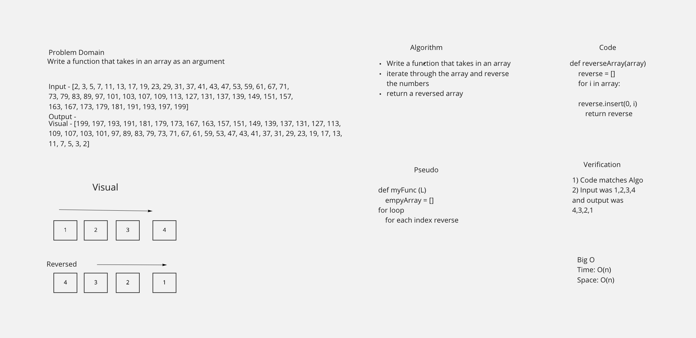

# Code Challenges

# Reverse an Array

## Challenge

<!-- Description of the challenge -->

Write a function that reverses an array, in place

Be careful of: empty arrays, arrays with only 1, odd numbered count, even numbered count

## Approach & Efficiency

<!-- What approach did you take? Why? What is the Big O space/time for this approach? -->

-   Create a function that takes in an array
-   Inserting at zero th position
-   Reversed array complete

## Solution

<!-- Embedded whiteboard image -->

# Insert value into middle of list

-   Write a function called insertShiftArray which takes in an array and a value to be added. Without utilizing any of the built-in methods available to your language, return an array with the new value added at the middle index

## Whiteboard Process

## Approach & Efficiency

-   Handle edge cases. If input list is empty or None then return a single element list containing the new value. If input list only contains 1 element then append the new element to the end of the list and return the list Identify the midpoint by dividing the length of the list by 2 (integer division) Create variable current and initialize it to the index of the last element in the list Shift element at 'current' to the right then decrement current Continue to do this until current == midpoint Place new value at the midpoint then return the list
-   Complexity Analysis
    Time Complexity - O(n)
    Space Complexity - O(1)

# Binary Search of Sorted Array

**Author**: Arthur Lozano

## Overview

Write a function called BinarySearch which takes in 2 parameters: a sorted array and the search key. Without utilizing any of the built-in methods available to your language, return the index of the array’s element that is equal to the value of the search key, or -1 if the element is not in the array.

## Whiteboard Process

<!-- Embedded whiteboard image -->

[Github PR](./code_challenges/codeChallenge3/whiteboard/cc3.png)

## Approach & Efficiency

<!-- What approach did you take? Discuss Why. What is the Big O space/time for this approach? -->

-   Find mid point
-   Bring in the arr see if it matches midpoint
-   check if the target is less than or higher than midpoint
-   return true or false

## Big O

-   Time O(log n)
-   O(1)

